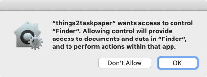
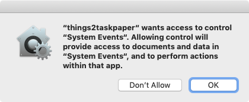

# Export your Things 3 database to TaskPaper

Here's a simple App to export from [Things 3 (by Cultured Code)](https://culturedcode.com/things/) to [TaskPaper](https://www.taskpaper.com).

I created this app because I discovered that for me Things works great for some use cases, but for others I want to use a plain text format: I use Things for capturing taks, ideas and bookmarks, for planning my day and for reminding me about all the stuff that I don't care about, but need to do anyway. For detailed planning, for managing ideas and things like reading lists, I am much more effective using TaskPaper files. So I have set up an area "Export" with several projects that act as buckets for certain topics like ideas, reading, research etc., and roughly every two weeks I use this app to export my Things Inbox and the "Export" area with this app and delete all those tasks in Thinks. This keeps my Things database nice and manageable.
 
Currently, the exporter has the following features:

- export tasks, projects (including the inbox) and areas 
- headers, checklists, notes
- tags for tasks, projects and areas
- done and trashed items are excluded
- due dates, start dates, today and someday are added as tags to projects and tasks

Repeating tasks are currently not supported. The exporter was tested with Things 3.13.6.

## Usage

Download the latest version of the app from the [releases page](https://github.com/bboc/things3-export/releases).

**Warning: Make sure to close Things before you run the app!!**

Run the app, you will see this screen:

Depending on your system, MacOS may present two dialogs to you, where it asks you for the permission to control Finder and System-Events. You have to grant these permissions for the app to work:

If you just click the button "EXPORT", the app will export your Things 3 database to a folder "Things 3 export" in your Downloads folder, with one Taskpaper-file per are. 

Here's a brief explanation of the options and other interface elements, from top to bottom:

- **Output as**: Select one of three output formats – all in one Taskpaper file, one Taskpaper file per area (default), or one Taskpapaer file for each project
- **EXPORT**: exports your things database with the selected options
- **Output file**: (optional) this will be used as a name of the export directory in your Downloads folder (or as a filename in case you want all in one file). If you enter nothing, the default will be "Things 3 export"
- **Select custom database**: (optional) Leave this empty if you want to use the default Things 3 database location. Otherwise click "Select File" to select another Things 3 database, you need to locate the file `main.sqklite` inside the thingsdatabase-bundle.
- **Exporter Output**: Here you will see what's happening during the export, sometimes helpful if things are not going according to plan.
- **Quit**: Close the app. 

That's it. Go to your Downloads folder to see the export.

## Command line Tools

In addition to the GUI-Version, the exporter can also be run from the command line.

By default, the exporter will create a folder for each area that contains a TaskPaper file per project. One file per area and one file with everything is also possible. To see what the exporter can do, open the Terminal app and run 

`$ python3 export_things.py -h`

### Setup

The exporter is Python program run from the command line, download `export_things.py` and `t2tp.sh` to a directory on your Mac, and then navigate to that directory in the Terminal app. 

#### Installing Python 3

While the app comes bundled with a Python interpreter, you need to have Python 3 installed to run the command line version. 

If you don't have it installed, here's what you need to do:

    $ xcode-select --install
    $ /usr/bin/ruby -e "$(curl -fsSL https://raw.githubusercontent.com/Homebrew/install/master/install)"
    $ brew install python3 

If you have Xcode or the Command Line Tools (CLT) for Xcode already installed, skip step 1. If you have [Homebrew](https://brew.sh) installed, skip step 2. If you have Python 3 already installed, why are you reading this anyway?

### Usage:

#### Work on the live database 

It's definitely a good idea to close things before you do that:

`$ source t2tp.sh`

You will find all your tasks in a folder called `export data`, one TaskPaper file per project, areas are grouped in subfolders.

If you prefer one TaskPaper file per area, you can add the option `--format area`, if you prefer one file with everything, just add `--format all`.

#### Work on a copy of the database

Copy the things database to the same folder where you downloaded the script:
    
`$ cp ~/Library/Group\ Containers/JLMPQHK86H.com.culturedcode.ThingsMac/Things\ Database.thingsdatabase/main.sqlite .` 

then run the exporter:

`$ python3 export_things.py`

### Restore a database backup in Things 3

If you, like me, play around with your Things database and accidentally sync changes you don't want back to the Things cloud, [here's how to restore a backup database](https://support.culturedcode.com/customer/en/portal/articles/2803595-restoring-from-a-backup)

## Changelog 

- v 1.0.2. (2021-01-08): 
    -   re-designed the GUI for better usability
    -   default Things 3 database is now automatically selected 
    -   fixed a bug that prevented opening the file dialog for selecting the database
-   v1.0.1 (2020-12-20)
    -   added support for new Database location in Things 3.13+
